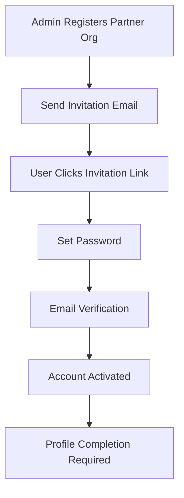
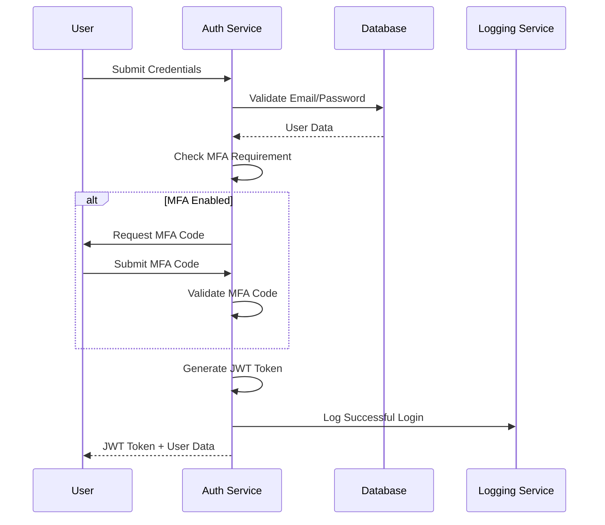
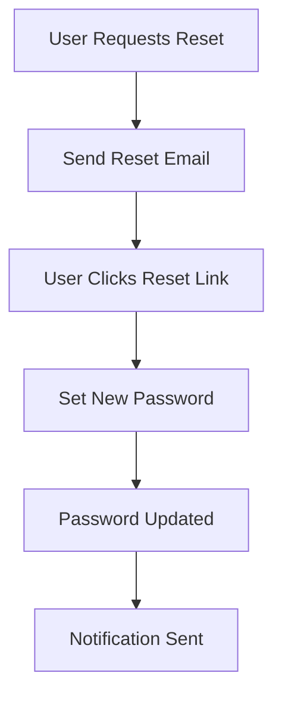
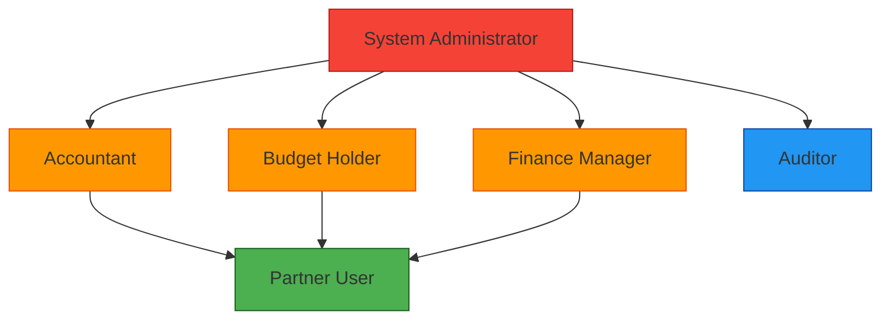

# Authentication and Authorization System

## 1. Overview

The authentication and authorization system provides secure access control for the Sub-Grant Management Platform. It implements a robust Role-Based Access Control (RBAC) model with multi-factor authentication (MFA) and comprehensive audit logging.

## 2. Authentication System

### 2.1 User Registration

#### 2.1.1 Partner User Registration


#### 2.1.2 HQ User Registration
- Admin-only registration
- Manual account creation by system administrators
- Role assignment during creation

### 2.2 Login Process

#### 2.2.1 Standard Login


#### 2.2.2 Password Requirements
- Minimum 12 characters
- At least one uppercase letter
- At least one lowercase letter
- At least one number
- At least one special character
- Not contain user's name or email
- Password history check (last 5 passwords)

### 2.3 Password Management

#### 2.3.1 Password Reset


#### 2.3.2 Password Expiration
- Passwords expire every 90 days
- Users notified 14, 7, and 2 days before expiration
- Account locked after password expiration

### 2.4 Multi-Factor Authentication (MFA)

#### 2.4.1 MFA Setup
- Time-based One-Time Password (TOTP) using apps like Google Authenticator
- SMS-based codes (backup option)
- Recovery codes for account recovery

#### 2.4.2 MFA Enforcement
- Required for all HQ users
- Optional but recommended for partner users
- Mandatory for users with approval privileges

#### 2.4.3 MFA Recovery
- Account recovery codes
- Admin-assisted recovery for locked accounts
- Email verification for recovery requests

## 3. Authorization System

### 3.1 Role-Based Access Control (RBAC)

#### 3.1.1 User Roles
| Role | Description | MFA Required |
|------|-------------|--------------|
| System Administrator | Full system access | Yes |
| Accountant | Budget review, disbursement management | Yes |
| Budget Holder | Budget approval, financial oversight | Yes |
| Finance Manager | Final budget approval, financial management | Yes |
| Partner User | Profile management, application submission | Optional |
| Auditor | Read-only access to reports | No |

#### 3.1.2 Role Hierarchy


### 3.2 Permission Model

#### 3.2.1 Permission Types
- **Read**: View data
- **Create**: Create new records
- **Update**: Modify existing records
- **Delete**: Remove records
- **Approve**: Approve workflows
- **Export**: Export data

#### 3.2.2 Resource-Based Permissions
| Resource | Admin | Accountant | Budget Holder | Finance Manager | Partner | Auditor |
|----------|-------|------------|---------------|-----------------|---------|---------|
| Organizations | CRUD | R | R | R | RU | R |
| Users | CRUD | R | R | R | RU | R |
| Projects | CRUD | CRUD | CRUD | CRUD | R | R |
| Budgets | CRUD | CRU | CRU | CRUD | CRUD | R |
| Contracts | CRUD | CRU | CRU | CRUD | CRU | R |
| Disbursements | CRUD | CRUD | CRU | CRUD | R | R |
| Reports | CRUD | CRU | CRU | CRUD | CRUD | R |
| Documents | CRUD | CRU | CRU | CRUD | CRUD | R |

### 3.3 Access Control Implementation

#### 3.3.1 JWT Token Structure
```json
{
  "sub": "user_id",
  "email": "user@example.com",
  "role": "finance_manager",
  "org_id": "organization_id",
  "permissions": ["budget:create", "budget:read", "budget:update", "budget:approve"],
  "iat": 1516239022,
  "exp": 1516242622
}
```

#### 3.3.2 Permission Checking
```javascript
// Pseudocode for permission checking
function checkPermission(user, resource, action) {
  // Check role-based permissions
  const rolePermissions = getRolePermissions(user.role);
  
  // Check organization-based access
  if (!hasOrganizationAccess(user, resource)) {
    return false;
  }
  
  // Check specific permissions
  return rolePermissions.includes(`${resource}:${action}`);
}
```

## 4. Session Management

### 4.1 Session Handling
- JWT tokens with 4-hour expiration
- Refresh tokens for extended sessions
- Server-side session tracking for immediate revocation

### 4.2 Session Security
- Secure, HttpOnly cookies
- SameSite attribute protection
- Token rotation on each request
- Immediate invalidation on logout

### 4.3 Concurrent Session Control
- Maximum 3 concurrent sessions per user
- Session activity monitoring
- Admin ability to terminate user sessions

## 5. Security Measures

### 5.1 Authentication Security
- Rate limiting on login attempts (5 attempts per 15 minutes)
- Account lockout after 5 failed attempts
- IP-based blocking for suspicious activity
- Brute force protection

### 5.2 Password Security
- bcrypt hashing with salt
- Minimum password complexity requirements
- Password history enforcement
- Regular security audits

### 5.3 Transport Security
- HTTPS enforcement for all communications
- HSTS header implementation
- Secure cookie flags
- Content Security Policy

### 5.4 Data Protection
- Encryption at rest for sensitive data
- Field-level encryption for PII
- Secure key management
- Regular key rotation

## 6. Audit and Compliance

### 6.1 Authentication Logging
All authentication events are logged:
- Successful logins
- Failed login attempts
- Password changes
- MFA events
- Account lockouts

### 6.2 Authorization Logging
Access control events:
- Permission denied attempts
- Role changes
- Resource access patterns
- Privilege escalation attempts

### 6.3 Audit Trail Requirements
- Immutable logs
- Timestamps with timezone
- User identification
- IP address tracking
- User agent information
- Action details

## 7. API Security

### 7.1 Authentication Endpoints
```
POST /api/auth/register - User registration
POST /api/auth/login - User login
POST /api/auth/logout - User logout
POST /api/auth/refresh - Token refresh
POST /api/auth/forgot-password - Password reset request
POST /api/auth/reset-password - Password reset
POST /api/auth/mfa/setup - MFA setup
POST /api/auth/mfa/verify - MFA verification
```

### 7.2 Authorization Headers
```
Authorization: Bearer <jwt_token>
X-Organization-ID: <organization_id>
```

### 7.3 Security Headers
```
Strict-Transport-Security: max-age=31536000; includeSubDomains
X-Content-Type-Options: nosniff
X-Frame-Options: DENY
Content-Security-Policy: default-src 'self'
```

## 8. Integration with Other Systems

### 8.1 DocuSign Integration Authentication
- OAuth 2.0 for API access
- Secure token storage
- Token refresh handling
- Access scope limitation

### 8.2 Xero Integration Authentication
- OAuth 2.0 for API access
- Tenant-specific tokens
- Token refresh automation
- Reconnection handling

## 9. Compliance Requirements

### 9.1 GDPR Compliance
- Data minimization
- User consent tracking
- Right to erasure implementation
- Data portability support

### 9.2 SOX Compliance
- Audit trail integrity
- Access control documentation
- Change management procedures
- Segregation of duties

### 9.3 Security Standards
- OWASP Top 10 compliance
- NIST cybersecurity framework alignment
- ISO 27001 considerations
- Regular security assessments

## 10. Implementation Considerations

### 10.1 Scalability
- Stateless authentication services
- Distributed session management
- Caching for permission lookups
- Load balancing support

### 10.2 Performance
- Efficient JWT validation
- Database indexing for user lookups
- Caching for role permissions
- Asynchronous logging

### 10.3 Monitoring
- Authentication success/failure metrics
- Authorization denial rates
- MFA adoption tracking
- Security incident detection

### 10.4 Testing
- Unit tests for authentication logic
- Integration tests for authorization
- Security penetration testing
- Load testing for authentication services