# Module Specifications

## 1. Partner Onboarding & Profiles

### 1.1 Overview
The Partner Onboarding module manages the registration, verification, and profile management of partner organizations. This module ensures that all partners have completed due diligence before participating in sub-grant programs.

### 1.2 Key Features
- Organization registration and verification
- User account management
- Compliance documentation collection
- Profile maintenance and updates
- Due diligence validation workflows

### 1.3 User Flows

#### 1.3.1 Admin Registers New Partner
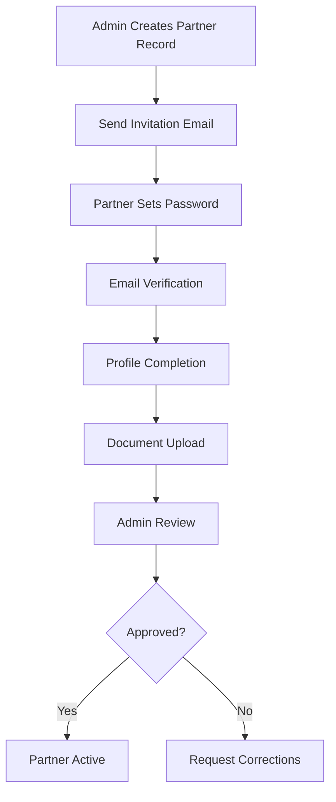

#### 1.3.2 Partner Profile Management
- Edit organization details
- Update contact information
- Manage user accounts
- Upload/renew compliance documents
- Track verification status

### 1.4 Data Requirements
- Organization legal name and registration details
- Physical and mailing addresses
- Primary and secondary contacts
- Banking information for disbursements
- Compliance documents (registration, tax, insurance, etc.)
- Due diligence verification status

### 1.5 Validation Rules
- Unique organization name and registration number
- Valid email and phone number formats
- Required compliance documents based on organization type
- Due diligence expiration tracking

## 2. Grants & Projects

### 2.1 Overview
The Grants & Projects module manages the creation and administration of funding calls and projects. This module defines the scope, timeline, and budget parameters for sub-grant opportunities.

### 2.2 Key Features
- Project/call creation and configuration
- Timeline and submission window management
- Budget category and cap definition
- Multi-currency support
- Project status tracking

### 2.3 User Flows

#### 2.3.1 Admin Creates New Project
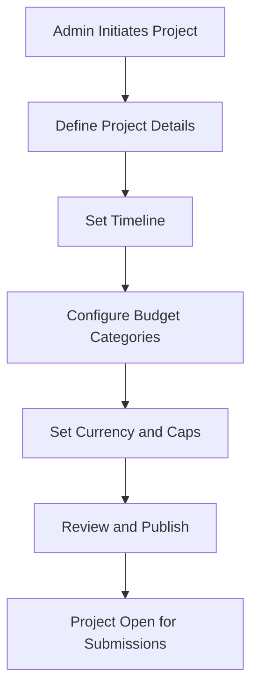

#### 2.3.2 Partner Submits Application
- View open calls
- Review project requirements
- Prepare application materials
- Submit application within deadline

### 2.4 Data Requirements
- Project name, description, and objectives
- Open and close dates for submissions
- Budget categories and spending caps
- Currency settings
- Eligibility criteria
- Required documentation templates

### 2.5 Validation Rules
- Close date must be after open date
- Budget category caps must be positive values
- Currency must be valid ISO code
- Project name must be unique

## 3. Budgeting & Approval (3-tier)

### 3.1 Overview
The Budgeting module enables partners to create detailed budgets for their projects, with a structured approval workflow involving multiple levels of review.

### 3.2 Key Features
- Budget template creation and management
- Line item budgeting with category validation
- Multi-tier approval workflow (Accountant → Budget Holder → Finance Manager)
- Inline review comments and revision requests
- Budget versioning and history

### 3.3 User Flows

#### 3.3.1 Partner Creates Budget
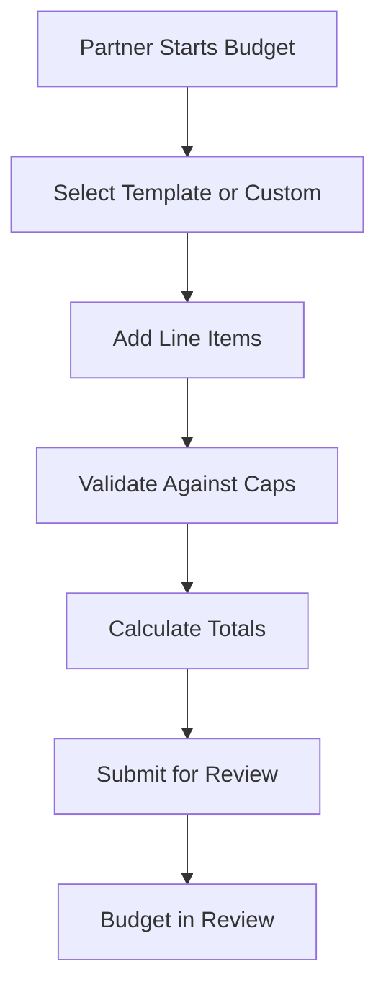

#### 3.3.2 Multi-tier Approval Process
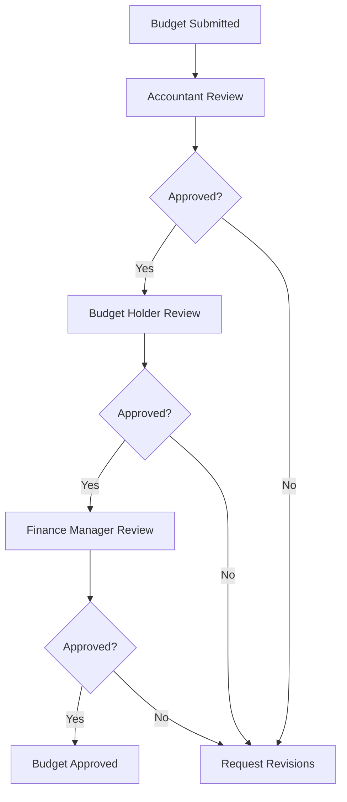

### 3.4 Data Requirements
- Budget title and description
- Line items with categories, quantities, and costs
- Total budget amount
- Review comments and revision history
- Approval timestamps and approver details

### 3.5 Validation Rules
- Line items must map to valid project categories
- Line item amounts must not exceed category caps
- Total budget must not exceed project limits
- Required fields must be completed

## 4. Digital Contracts (DocuSign)

### 4.1 Overview
The Digital Contracts module automates the generation, signing, and storage of legal agreements using DocuSign integration.

### 4.2 Key Features
- Automated contract generation from templates
- DocuSign envelope creation and sending
- Real-time status tracking
- Signed document storage and versioning
- Audit trail for contract history

### 4.3 User Flows

#### 4.3.1 Contract Generation and Sending
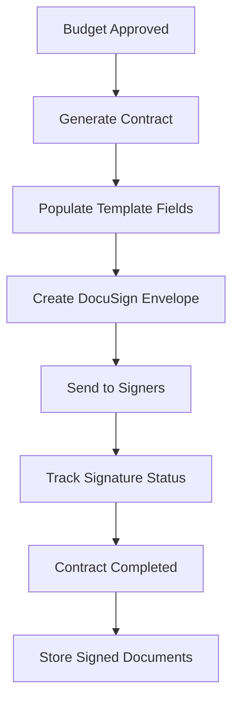

#### 4.3.2 Contract Management
- View contract status
- Download signed agreements
- Track signing progress
- Access contract history

### 4.4 Data Requirements
- Contract template references
- Merged data fields
- DocuSign envelope IDs
- Signer information and status
- Signed document artifacts

### 4.5 Validation Rules
- Budget must be approved before contract generation
- All required template fields must be populated
- Signer email addresses must be valid
- Contract status transitions must follow defined workflow

## 5. Disbursements & Financial Sync (Xero)

### 5.1 Overview
The Disbursements module manages the planning and execution of fund transfers to partners, with integration to Xero for accounting synchronization.

### 5.2 Key Features
- Tranche planning and scheduling
- Invoice/bill creation in Xero
- Payment status tracking
- Reconciliation with bank statements
- Evidence attachment for transactions

### 5.3 User Flows

#### 5.3.1 Admin Plans Disbursement
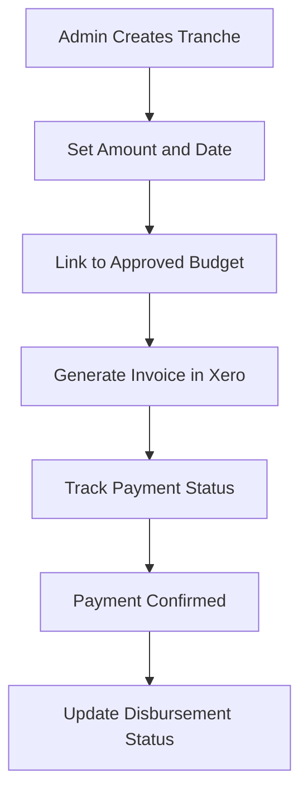

#### 5.3.2 Payment Reconciliation
- Automatic status updates from Xero
- Manual reconciliation for exceptions
- Evidence attachment for audit purposes
- Disbursement closure when complete

### 5.4 Data Requirements
- Tranche schedule and amounts
- Xero invoice/bill references
- Payment confirmation details
- Reconciliation status and timestamps
- Supporting documentation

### 5.5 Validation Rules
- Disbursement amount must not exceed approved budget
- Tranche dates must be within project timeline
- Xero contact must exist for partner
- Payment evidence must be attached for reconciliation

## 6. Monitoring & Evaluation (M&E)

### 6.1 Overview
The M&E module tracks project progress, outcomes, and risks through structured reporting and dashboard visualization.

### 6.2 Key Features
- KPI definition and tracking
- Progress milestone reporting
- Risk and issue management
- Dashboard visualization
- Automated alerts for risks and delays

### 6.3 User Flows

#### 6.3.1 Partner Submits Progress Report
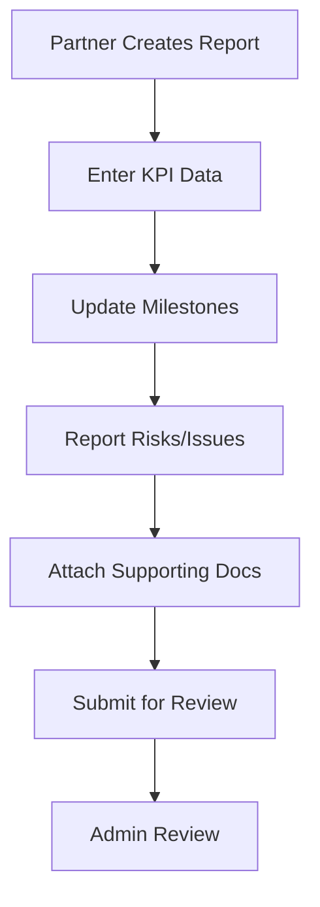

#### 6.3.2 Admin Reviews and Monitors
- Review submitted reports
- Track KPI achievement
- Monitor risk indicators
- Generate progress dashboards

### 6.4 Data Requirements
- KPI definitions and targets
- Progress data and milestones
- Risk and issue logs
- Supporting documentation
- Review comments and status

### 6.5 Validation Rules
- Report dates must be within project period
- Required KPIs must be reported
- Risk severity levels must be valid
- Supporting documents must be attached for key milestones

## 7. Financial Retirement & Reconciliation

### 7.1 Overview
The Financial Retirement module manages the process of reporting actual expenditures and reconciling them with approved budgets.

### 7.2 Key Features
- Expenditure reporting against budget lines
- Receipt attachment and validation
- Review and approval workflow
- Variance analysis
- Project closure and archival

### 7.3 User Flows

#### 7.3.1 Partner Submits Financial Report
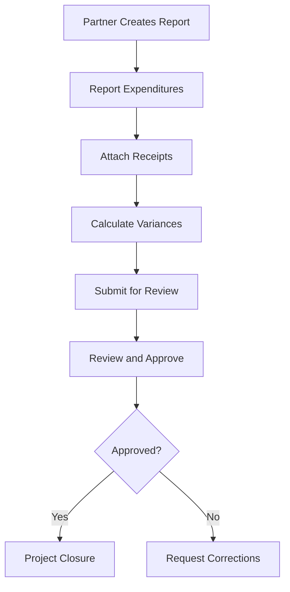

#### 7.3.2 Admin Reviews Financials
- Validate reported expenditures
- Review attached receipts
- Analyze budget variances
- Approve or request corrections

### 7.4 Data Requirements
- Expenditure details by budget line
- Receipt documents with metadata
- Variance calculations
- Review comments and status
- Closure documentation

### 7.5 Validation Rules
- Total expenditures must match receipt amounts
- Expenditures must map to approved budget lines
- Required receipts must be attached
- Variance explanations must be provided for significant differences

## 8. Reporting & Analytics

### 8.1 Overview
The Reporting & Analytics module provides comprehensive dashboards and reports for monitoring program performance, financials, and compliance.

### 8.2 Key Features
- Executive dashboards
- Budget vs. actual reporting
- Compliance tracking
- Risk and exception reporting
- Export capabilities (PDF, Excel)

### 8.3 User Flows

#### 8.3.1 Admin Views Dashboard
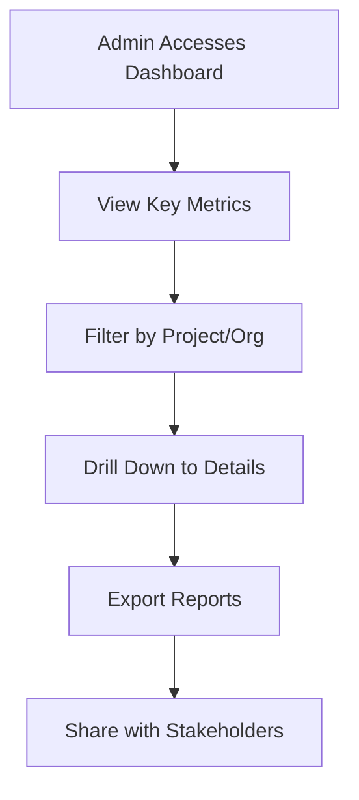

#### 8.3.2 Donor/Auditor Access
- Limited dashboard views
- Approved report access
- Export functionality with restrictions

### 8.4 Data Requirements
- Aggregated performance metrics
- Financial summary data
- Compliance status indicators
- Risk and exception reports
- Export templates and formats

### 8.5 Validation Rules
- Data access restricted by user role
- Export formats must comply with security policies
- Dashboard refresh intervals must meet performance requirements
- Report generation must not impact system performance

## 9. Documents, Versioning & Audit

### 9.1 Overview
The Document Management module provides secure storage, version control, and audit capabilities for all system documents.

### 9.2 Key Features
- Centralized document storage
- Version control with history
- Checksum validation
- Metadata management
- Immutable audit logs

### 9.3 User Flows

#### 9.3.1 User Uploads Document
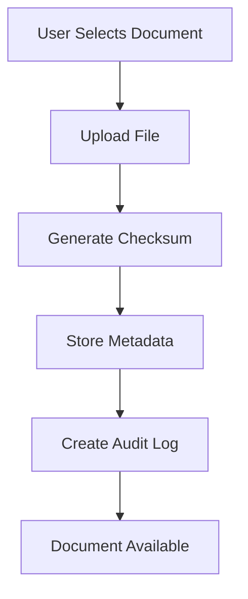

#### 9.3.2 User Accesses Document
- Search and browse documents
- View document versions
- Download specific versions
- View audit history

### 9.4 Data Requirements
- Document content and metadata
- Version history
- Checksums for integrity verification
- Access logs and audit trails
- Retention and legal hold flags

### 9.5 Validation Rules
- File types must be approved
- File sizes must be within limits
- Checksums must validate correctly
- Access must be authorized by permissions
- Retention policies must be enforced

## 10. Notifications & Alerts

### 10.1 Overview
The Notifications module manages all system communications, including deadlines, approvals, and status updates.

### 10.2 Key Features
- Multi-channel notifications (email, in-app)
- Deadline reminder ladder (T-14/T-7/T-2/T-0)
- Escalation workflows
- Weekly digest emails
- Custom notification templates

### 10.3 User Flows

#### 10.3.1 System Sends Deadline Reminder
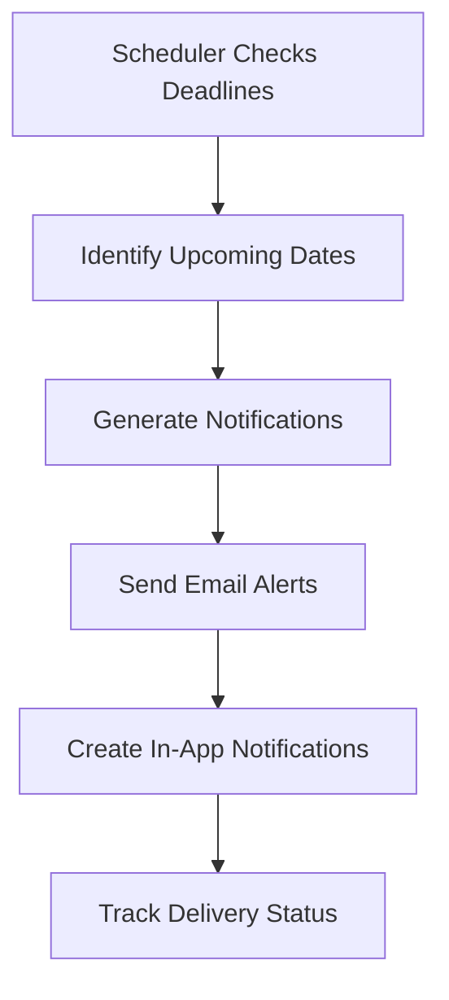

#### 10.3.2 User Manages Notifications
- View notification inbox
- Mark as read/unread
- Configure notification preferences
- Access related entities from notifications

### 10.4 Data Requirements
- Notification templates
- Delivery channel preferences
- Schedule and timing rules
- Delivery status tracking
- User preference settings

### 10.5 Validation Rules
- Notification recipients must be valid
- Templates must exist for notification types
- Delivery channels must be configured
- Frequency limits must prevent spam
- Escalation rules must follow organizational hierarchy

## 11. Module Dependencies

### 11.1 Cross-Module Relationships
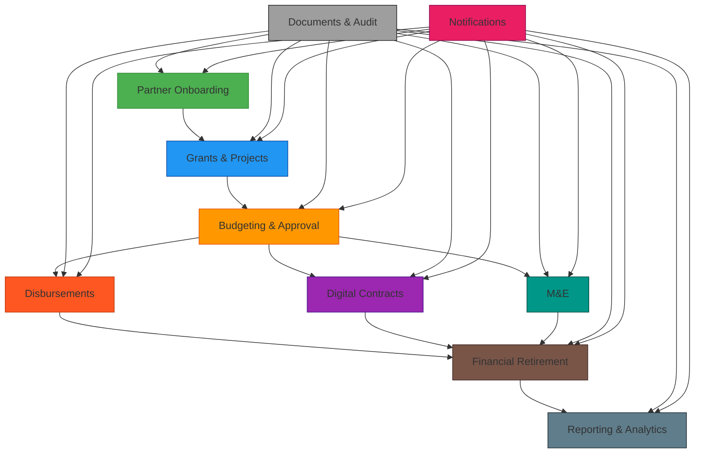

### 11.2 Data Flow Between Modules
- Partner data flows from Onboarding to all other modules
- Project data flows from Grants to Budgeting and related modules
- Budget approvals trigger Contracts and Disbursements
- M&E and Financial data feed into Reporting
- All modules contribute to Documents and Audit
- All modules generate Notifications

## 12. Implementation Considerations

### 12.1 User Experience
- Consistent UI patterns across modules
- Role-based navigation and features
- Mobile-responsive design
- Accessibility compliance (WCAG 2.1 AA)
- Multilingual support (EN/FR/ES/PT)

### 12.2 Performance
- Module-level caching strategies
- Database query optimization
- Asynchronous processing for long-running operations
- Pagination for large data sets
- Efficient file handling

### 12.3 Security
- Module-specific permission models
- Data isolation between organizations
- Audit logging for all module activities
- Secure API endpoints
- Input validation and sanitization

### 12.4 Integration Points
- DocuSign integration in Contracts module
- Xero integration in Disbursements module
- Email service integration in Notifications module
- Cloud storage integration in Documents module
- Reporting service integration in Analytics module