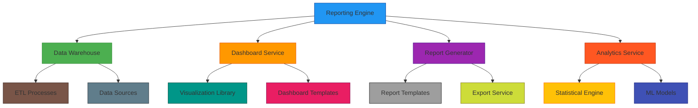
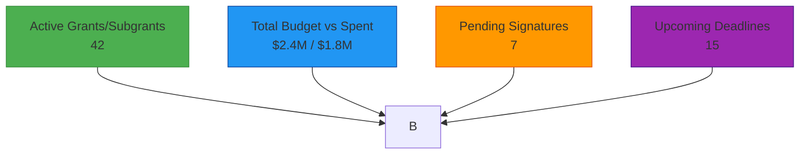

# Reporting and Analytics

## 1. Overview

The Reporting and Analytics module provides comprehensive insights into sub-grant program performance, financial management, and compliance status. This module serves different user roles with tailored dashboards, automated reports, and advanced analytical capabilities.

## 2. Architecture

### 2.1 High-Level Design



### 2.2 Core Components

#### 2.2.1 Data Warehouse
- Centralized data storage for reporting
- Historical data aggregation
- Pre-computed metrics and dimensions
- Data quality and validation

#### 2.2.2 Dashboard Service
- Interactive dashboard rendering
- Real-time data visualization
- Custom dashboard creation
- Role-based dashboard access

#### 2.2.3 Report Generator
- Scheduled report creation
- Ad-hoc report generation
- Report template management
- Multi-format export capabilities

#### 2.2.4 Analytics Service
- Statistical analysis capabilities
- Predictive modeling
- Trend identification
- Anomaly detection

## 3. Dashboard Design

### 3.1 Admin/HQ Dashboard

#### 3.1.1 Overview Cards


#### 3.1.2 Status Visualizations
- **Lifecycle by Stage**
  - Pipeline visualization showing grants at different stages
  - Time-in-stage analysis
  - Bottleneck identification

- **Consumption vs Allocation**
  - Budget utilization charts
  - Spending trends over time
  - Category-wise allocation

- **Compliance Heatmap**
  - On-time submission rates
  - Missing documentation tracking
  - Risk assessment scores

#### 3.1.3 Task Tracker Calendar
- Contract signing deadlines
- Payment due dates
- Report submission dates
- Color-coded priority levels

#### 3.1.4 Financial Snapshot
- Pending reconciliation status
- Retirement completion rates
- Cash flow projections
- Variance analysis

#### 3.1.5 Activity Feed
- Recent system activities
- Deep links to related entities
- User action tracking
- Audit trail integration

### 3.2 Partner Dashboard

#### 3.2.1 Application Status
- Budget submission status
- Document checklist progress
- Corrections requested tracking
- Approval timeline

#### 3.2.2 Contract Status
- Pending signatures
- Signed document download
- Expiration tracking
- Renewal reminders

#### 3.2.3 Budget Summary
- Allocation overview
- Spend to date
- Milestone/payment schedule
- Variance indicators

#### 3.2.4 Reminders
- Upcoming report deadlines
- Compliance requirements
- Document expiration notices
- Action item tracking

### 3.3 Donor/Auditor Dashboard

#### 3.3.1 Program Overview
- High-level program metrics
- Geographic distribution
- Beneficiary reach
- Outcome achievements

#### 3.3.2 Financial Transparency
- Fund utilization rates
- Disbursement timelines
- Budget vs. actual comparisons
- Audit readiness indicators

#### 3.3.3 Compliance Status
- Reporting compliance rates
- Risk mitigation progress
- Exception tracking
- Corrective action status

## 4. Report Types

### 4.1 Operational Reports

#### 4.1.1 Pipeline by Stage
- Grants in each lifecycle stage
- Time-to-stage analysis
- Bottleneck identification
- Capacity planning insights

#### 4.1.2 Approval Throughput
- Approval rates by reviewer
- Average approval times
- Revision cycle analysis
- Workload distribution

#### 4.1.3 Corrections Analysis
- Common revision reasons
- Partner performance metrics
- Template effectiveness
- Training needs identification

#### 4.1.4 Timing Metrics
- Time-to-sign contracts
- Time-to-process payments
- Time-to-complete reports
- Service level agreement tracking

### 4.2 Financial Reports

#### 4.2.1 Budget vs. Actuals
- Category-wise comparisons
- Variance analysis
- Trend identification
- Forecasting support

#### 4.2.2 Burn Rate Analysis
- Spending velocity
- Runway calculations
- Category performance
- Adjustment recommendations

#### 4.2.3 Variance Reporting
- Organization-level variances
- Category-level analysis
- Explanation tracking
- Corrective action planning

#### 4.2.4 Disbursement Tracking
- Milestone achievement vs. payment
- Payment timing analysis
- Reconciliation status
- Cash flow optimization

### 4.3 Compliance/Risk Reports

#### 4.3.1 Submission Tracking
- On-time submission rates
- Late submission analysis
- Pattern identification
- Improvement recommendations

#### 4.3.2 Evidence Compliance
- Missing receipt tracking
- Documentation completeness
- Quality assessment
- Follow-up requirements

#### 4.3.3 Overspend Detection
- Budget line monitoring
- Threshold alerts
- Root cause analysis
- Mitigation tracking

#### 4.3.4 Exception Logging
- System exceptions
- Process deviations
- Security incidents
- Resolution tracking

### 4.4 Impact Reports

#### 4.4.1 Outcome Tracking
- KPI achievement rates
- Beneficiary impact
- Geographic reach
- Sustainability indicators

#### 4.4.2 Risk Assessment
- Project risk scores
- Mitigation effectiveness
- Trend analysis
- Early warning indicators

#### 4.4.3 Performance Benchmarks
- Organization performance comparisons
- Best practice identification
- Improvement opportunities
- Recognition programs

## 5. Data Model for Analytics

### 5.1 Star Schema Design

#### 5.1.1 Fact Tables
```sql
-- Grant Facts
CREATE TABLE fact_grants (
    grant_id UUID,
    organization_id UUID,
    project_id UUID,
    budget_amount DECIMAL(15,2),
    approved_amount DECIMAL(15,2),
    disbursed_amount DECIMAL(15,2),
    spent_amount DECIMAL(15,2),
    start_date DATE,
    end_date DATE,
    approval_date DATE,
    close_date DATE,
    status VARCHAR(50),
    days_to_approve INTEGER,
    days_active INTEGER,
    variance_percentage DECIMAL(5,2),
    created_at TIMESTAMP,
    updated_at TIMESTAMP
);

-- Disbursement Facts
CREATE TABLE fact_disbursements (
    disbursement_id UUID,
    grant_id UUID,
    organization_id UUID,
    planned_amount DECIMAL(15,2),
    actual_amount DECIMAL(15,2),
    planned_date DATE,
    actual_date DATE,
    days_late INTEGER,
    status VARCHAR(50),
    created_at TIMESTAMP
);

-- Report Facts
CREATE TABLE fact_reports (
    report_id UUID,
    grant_id UUID,
    organization_id UUID,
    report_date DATE,
    submission_date DATE,
    approval_date DATE,
    days_late INTEGER,
    status VARCHAR(50),
    kpi_score DECIMAL(5,2),
    created_at TIMESTAMP
);
```

#### 5.1.2 Dimension Tables
```sql
-- Organization Dimension
CREATE TABLE dim_organizations (
    organization_id UUID,
    name VARCHAR(255),
    country VARCHAR(100),
    organization_type VARCHAR(100),
    registration_date DATE,
    compliance_status VARCHAR(50),
    risk_score DECIMAL(5,2)
);

-- Project Dimension
CREATE TABLE dim_projects (
    project_id UUID,
    name VARCHAR(255),
    category VARCHAR(100),
    start_date DATE,
    end_date DATE,
    budget_cap DECIMAL(15,2),
    currency VARCHAR(3)
);

-- Time Dimension
CREATE TABLE dim_time (
    date_key DATE,
    year INTEGER,
    quarter INTEGER,
    month INTEGER,
    week INTEGER,
    day INTEGER,
    day_of_week VARCHAR(10),
    is_weekend BOOLEAN,
    is_holiday BOOLEAN
);

-- User Dimension
CREATE TABLE dim_users (
    user_id UUID,
    organization_id UUID,
    role VARCHAR(50),
    department VARCHAR(100),
    hire_date DATE
);
```

### 5.2 ETL Process

#### 5.2.1 Data Sources
- Transactional database
- Document management system
- Integration APIs (DocuSign, Xero)
- External data sources

#### 5.2.2 Transformation Logic
```python
# Pseudocode for ETL transformation
def transform_grant_data(raw_data):
    # Calculate derived metrics
    grant_data = {
        'grant_id': raw_data['id'],
        'organization_id': raw_data['organization_id'],
        'project_id': raw_data['project_id'],
        'budget_amount': raw_data['total_amount'],
        'approved_amount': get_approved_amount(raw_data['id']),
        'disbursed_amount': get_disbursed_amount(raw_data['id']),
        'spent_amount': get_spent_amount(raw_data['id']),
        'status': raw_data['status'],
        'days_to_approve': calculate_days_to_approve(raw_data),
        'variance_percentage': calculate_variance(raw_data),
        # ... additional transformations
    }
    
    return grant_data
```

#### 5.2.3 Scheduling
- Real-time updates for critical metrics
- Hourly aggregation for operational data
- Daily batch processing for historical data
- Monthly rollups for trend analysis

## 6. Visualization Guidelines

### 6.1 UI Components

#### 6.1.1 Card Layout
- Consistent sizing and spacing
- Clear metric labeling
- Trend indicators
- Drill-down capabilities

#### 6.1.2 Chart Types
- **Line Charts**: Trend analysis over time
- **Bar Charts**: Category comparisons
- **Pie Charts**: Proportional distributions
- **Heatmaps**: Compliance and risk scoring
- **Gauges**: Progress toward targets
- **Tables**: Detailed data views

#### 6.1.3 Color Coding
- **Green**: On track, positive trends
- **Yellow**: At risk, requires attention
- **Red**: Overdue, critical issues
- **Blue**: Neutral, informational

### 6.2 Interactive Features

#### 6.2.1 Filtering
- Date range selection
- Organization filtering
- Project/category filtering
- Status filtering

#### 6.2.2 Drill-Down
- Click-through to detailed views
- Hierarchical data exploration
- Contextual information display

#### 6.2.3 Export Options
- PDF report generation
- Excel data export
- Image chart export
- Dashboard sharing

## 7. Export Capabilities

### 7.1 Export Formats

#### 7.1.1 PDF Reports
- Professional formatting
- Header/footer with branding
- Page numbering and TOC
- Chart and table inclusion

#### 7.1.2 Excel Exports
- Data tables with formulas
- Pivot table support
- Chart inclusion
- Multiple worksheet organization

#### 7.1.3 CSV Data
- Raw data export
- Comma-separated values
- UTF-8 encoding
- Large dataset handling

### 7.2 Export Customization

#### 7.2.1 Template Management
- Report template creation
- Branding customization
- Layout configuration
- Field selection

#### 7.2.2 Scheduled Exports
- Recurring report generation
- Automated delivery
- Format selection
- Recipient management

## 8. Advanced Analytics

### 8.1 Predictive Modeling

#### 8.1.1 Risk Scoring
- Machine learning model for risk prediction
- Feature importance analysis
- Continuous model refinement
- Risk mitigation recommendations

#### 8.1.2 Budget Forecasting
- Time series analysis for spending patterns
- Seasonal trend identification
- Anomaly detection
- Adjustment suggestions

### 8.2 Statistical Analysis

#### 8.2.1 Correlation Analysis
- Budget vs. outcome correlations
- Timing impact assessment
- Resource allocation effectiveness
- Performance driver identification

#### 8.2.2 Regression Modeling
- Performance prediction models
- Factor influence quantification
- Scenario planning support
- Optimization recommendations

## 9. Implementation Roadmap

### 9.1 Phase 1: Core Reporting
- Basic dashboard implementation
- Standard report templates
- PDF/Excel export capabilities
- Role-based access control

### 9.2 Phase 2: Advanced Visualization
- Interactive dashboards
- Real-time data updates
- Custom dashboard builder
- Mobile-responsive design

### 9.3 Phase 3: Analytics Enhancement
- Predictive modeling integration
- Statistical analysis tools
- Anomaly detection
- Automated insights generation

### 9.4 Phase 4: Optimization
- Performance optimization
- User experience improvements
- Advanced filtering and search
- Integration with external BI tools

## 10. Security and Compliance

### 10.1 Data Access Control
- Role-based dashboard access
- Row-level security for sensitive data
- Export permission management
- Audit logging for report access

### 10.2 Data Privacy
- GDPR compliance for report data
- PII anonymization in exports
- Data retention policies
- Secure data transmission

### 10.3 Compliance Reporting
- Audit trail for report generation
- Data source documentation
- Methodology transparency
- Regulatory compliance alignment