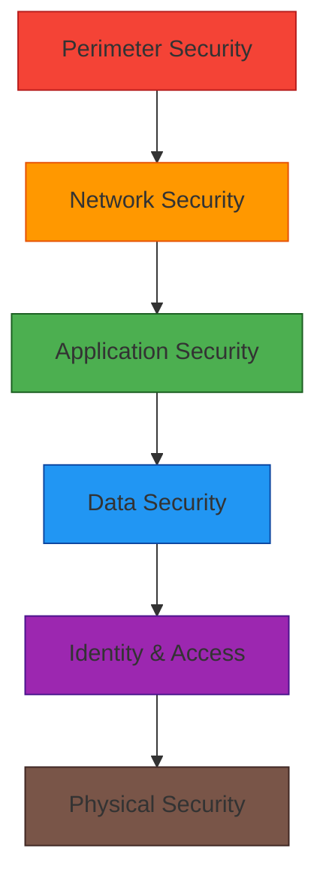
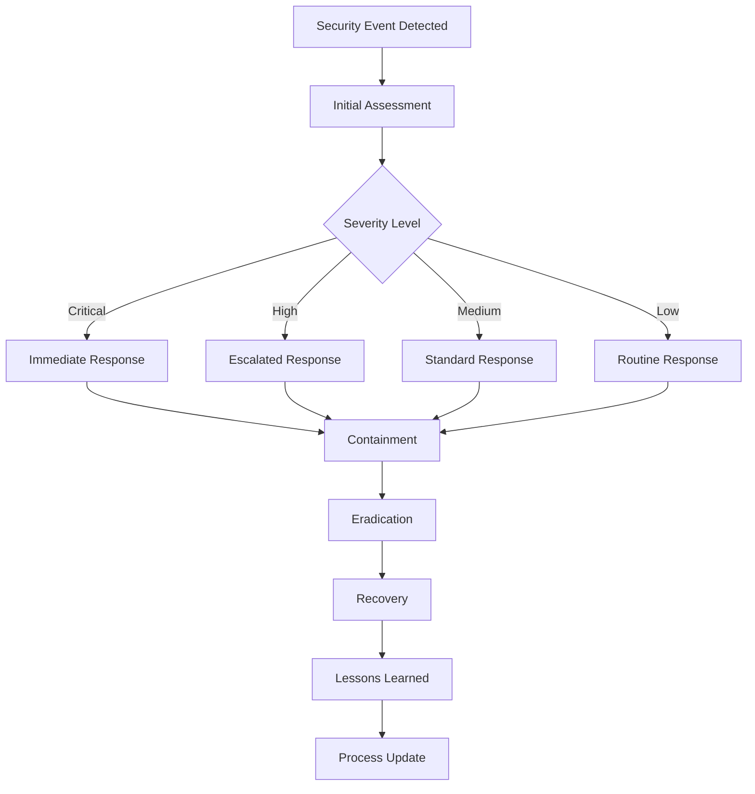

# Security and Compliance

## 1. Overview

The Security and Compliance framework ensures the Sub-Grant Management Platform meets industry standards for data protection, privacy, and regulatory requirements. This framework implements a defense-in-depth approach with multiple layers of security controls.

## 2. Security Architecture

### 2.1 Security Layers



### 2.2 Security Controls Matrix

| Control Category | Controls Implemented | Compliance Mapping |
|------------------|---------------------|-------------------|
| Access Control | RBAC, MFA, Session Management | GDPR, SOX, ISO 27001 |
| Data Protection | Encryption, Tokenization, Masking | GDPR, PCI DSS |
| Network Security | Firewall, IDS/IPS, Segmentation | ISO 27001, NIST |
| Application Security | Input Validation, OWASP Top 10 | OWASP, ISO 27001 |
| Audit & Monitoring | Logging, SIEM, Alerting | SOX, GDPR, ISO 27001 |
| Business Continuity | Backup, DR, Incident Response | ISO 27001, NIST |

## 3. Identity and Access Management

### 3.1 Authentication Security

#### 3.1.1 Multi-Factor Authentication
- Time-based One-Time Password (TOTP)
- SMS-based backup codes
- Hardware security keys (future enhancement)
- Biometric authentication (future enhancement)

#### 3.1.2 Password Security
```javascript
// Pseudocode for password policy enforcement
class PasswordPolicy {
  validate(password) {
    const errors = [];
    
    if (password.length < 12) {
      errors.push('Password must be at least 12 characters');
    }
    
    if (!/[A-Z]/.test(password)) {
      errors.push('Password must contain uppercase letters');
    }
    
    if (!/[a-z]/.test(password)) {
      errors.push('Password must contain lowercase letters');
    }
    
    if (!/[0-9]/.test(password)) {
      errors.push('Password must contain numbers');
    }
    
    if (!/[^A-Za-z0-9]/.test(password)) {
      errors.push('Password must contain special characters');
    }
    
    return errors;
  }
}
```

#### 3.1.3 Session Management
- JWT tokens with 4-hour expiration
- Refresh token rotation
- Server-side session tracking
- Immediate session invalidation

### 3.2 Authorization Model

#### 3.2.1 Role-Based Access Control (RBAC)
- Strict separation of duties
- Least privilege principle
- Role hierarchy enforcement
- Dynamic permission assignment

#### 3.2.2 Attribute-Based Access Control (ABAC)
- Organization-based data isolation
- Project-based access control
- Time-based access restrictions
- Context-aware permissions

#### 3.2.3 Access Control Implementation
```javascript
// Pseudocode for access control check
function checkAccess(user, resource, action) {
  // Check role-based permissions
  if (!hasRolePermission(user.role, resource, action)) {
    return false;
  }
  
  // Check organization access
  if (!hasOrganizationAccess(user.organization_id, resource)) {
    return false;
  }
  
  // Check ABAC policies
  if (!evaluateABACPolicies(user, resource, action)) {
    return false;
  }
  
  return true;
}
```

## 4. Data Protection

### 4.1 Encryption Strategy

#### 4.1.1 Data at Rest
- AES-256 encryption for database
- Field-level encryption for PII
- Key management with hardware security modules
- Regular key rotation

#### 4.1.2 Data in Transit
- TLS 1.3 for all communications
- Perfect Forward Secrecy (PFS)
- Certificate pinning for critical services
- Mutual TLS for service-to-service communication

#### 4.1.3 Key Management
```javascript
// Pseudocode for key management
class KeyManager {
  async encrypt(data, keyId) {
    const key = await this.getKey(keyId);
    const encrypted = await crypto.encrypt(data, key);
    return {
      data: encrypted,
      keyId: keyId,
      timestamp: new Date()
    };
  }
  
  async decrypt(encryptedData, keyId) {
    const key = await this.getKey(keyId);
    return await crypto.decrypt(encryptedData.data, key);
  }
}
```

### 4.2 Data Privacy

#### 4.2.1 Personally Identifiable Information (PII)
- Minimal data collection
- Data anonymization for analytics
- Pseudonymization for processing
- Right to erasure implementation

#### 4.2.2 Data Classification
| Classification | Examples | Protection Level |
|---------------|----------|------------------|
| Public | Organization names, project titles | Basic |
| Internal | User profiles, budget details | Standard |
| Confidential | Financial data, contracts | High |
| Restricted | Personal identification, passwords | Maximum |

#### 4.2.3 Data Handling Procedures
- Data minimization principles
- Purpose limitation enforcement
- Storage limitation policies
- Integrity and confidentiality measures

## 5. Network Security

### 5.1 Perimeter Security

#### 5.1.1 Firewall Configuration
- Whitelist-based access control
- Port restrictions
- Protocol filtering
- Rate limiting

#### 5.1.2 Intrusion Detection
- Network-based IDS
- Host-based IDS
- Behavioral analysis
- Threat intelligence integration

### 5.2 Network Segmentation

#### 5.2.1 VLAN Isolation
- Management VLAN
- Application VLAN
- Database VLAN
- DMZ for public services

#### 5.2.2 Service Mesh
- Mutual TLS between services
- Traffic encryption
- Access control policies
- Observability

## 6. Application Security

### 6.1 Secure Coding Practices

#### 6.1.1 Input Validation
```javascript
// Pseudocode for input validation
class InputValidator {
  validateEmail(email) {
    const emailRegex = /^[^\s@]+@[^\s@]+\.[^\s@]+$/;
    return emailRegex.test(email);
  }
  
  validateString(input, maxLength = 255) {
    if (typeof input !== 'string') return false;
    if (input.length > maxLength) return false;
    if (/[<>]/.test(input)) return false; // Prevent XSS
    return true;
  }
  
  sanitizeInput(input) {
    return input.replace(/[<>]/g, '');
  }
}
```

#### 6.1.2 Output Encoding
- HTML entity encoding
- JavaScript string escaping
- CSS escaping
- URL encoding

### 6.2 OWASP Top 10 Compliance

#### 6.2.1 Injection Prevention
- Parameterized queries
- ORM usage
- Input validation
- Output encoding

#### 6.2.2 Broken Authentication
- Secure session management
- Multi-factor authentication
- Password security
- Login attempt limiting

#### 6.2.3 Sensitive Data Exposure
- Encryption everywhere
- Secure key management
- TLS enforcement
- Data minimization

#### 6.2.4 XML External Entities (XXE)
- XML parser hardening
- External entity blocking
- Input validation
- Secure parsing libraries

#### 6.2.5 Broken Access Control
- Server-side authorization
- Role-based access control
- Session management
- Security headers

## 7. Audit and Compliance

### 7.1 Audit Logging

#### 7.1.1 Log Categories
- Authentication events
- Authorization events
- Data access events
- System events
- Administrative events

#### 7.1.2 Log Structure
```json
{
  "timestamp": "2023-06-15T14:30:00Z",
  "actor": {
    "user_id": "uuid",
    "username": "john.doe@example.com",
    "role": "finance_manager"
  },
  "action": "budget_approved",
  "resource": {
    "type": "budget",
    "id": "uuid",
    "name": "Q3 Community Development"
  },
  "outcome": "success",
  "ip_address": "192.168.1.100",
  "user_agent": "Mozilla/5.0...",
  "before_state": {...},
  "after_state": {...}
}
```

#### 7.1.3 Log Storage and Retention
- Immutable log storage
- Encryption at rest
- 7-year retention for compliance
- Regular backup and integrity checks

### 7.2 Compliance Monitoring

#### 7.2.1 Automated Compliance Checks
- Daily security scans
- Weekly compliance reports
- Monthly penetration testing
- Quarterly compliance assessments

#### 7.2.2 Manual Compliance Activities
- Annual third-party audits
- Semi-annual policy reviews
- Quarterly staff training
- Monthly access reviews

## 8. Business Continuity

### 8.1 Backup Strategy

#### 8.1.1 Data Backup
- Daily full backups
- Hourly incremental backups
- Geographically distributed storage
- Encryption of backup data

#### 8.1.2 Backup Testing
- Monthly restore testing
- Annual disaster recovery drills
- Backup integrity verification
- Recovery time objective (RTO) testing

### 8.2 Incident Response

#### 8.2.1 Incident Classification
| Severity | Response Time | Notification |
|----------|---------------|--------------|
| Critical | 15 minutes | Executive team |
| High | 1 hour | Management |
| Medium | 4 hours | Team leads |
| Low | 24 hours | System owners |

#### 8.2.2 Incident Response Process


## 9. Regulatory Compliance

### 9.1 GDPR Compliance

#### 9.1.1 Data Subject Rights
- Right to access personal data
- Right to rectification
- Right to erasure
- Right to data portability
- Right to object

#### 9.1.2 Privacy by Design
- Data minimization
- Purpose limitation
- Privacy impact assessments
- Data protection officers

### 9.2 SOX Compliance

#### 9.2.1 Financial Controls
- Transaction logging
- Approval workflow tracking
- Access control for financial data
- Regular access reviews

#### 9.2.2 Audit Trail Requirements
- Immutable audit logs
- Timestamp accuracy
- User identification
- Action documentation

### 9.3 ISO 27001 Alignment

#### 9.3.1 Information Security Policy
- Management commitment
- Regular policy reviews
- Staff awareness training
- Compliance monitoring

#### 9.3.2 Risk Management
- Annual risk assessments
- Risk treatment plans
- Continuous monitoring
- Incident response procedures

## 10. Security Testing

### 10.1 Vulnerability Management

#### 10.1.1 Scanning Schedule
- Daily automated scans
- Weekly manual penetration tests
- Monthly third-party assessments
- Annual comprehensive audits

#### 10.1.2 Vulnerability Remediation
- Critical: 24 hours
- High: 7 days
- Medium: 30 days
- Low: 90 days

### 10.2 Penetration Testing

#### 10.2.1 Internal Testing
- Quarterly internal assessments
- Red team exercises
- Social engineering tests
- Physical security assessments

#### 10.2.2 External Testing
- Annual third-party penetration tests
- Bug bounty program
- Vendor security assessments
- Compliance audit support

## 11. Staff Training and Awareness

### 11.1 Security Training Program

#### 11.1.1 Role-Based Training
- Executive security awareness
- Developer secure coding
- Administrator security operations
- User security best practices

#### 11.1.2 Training Content
- Phishing awareness
- Password security
- Social engineering prevention
- Incident reporting procedures

### 11.2 Compliance Training

#### 11.2.1 Regulatory Training
- GDPR requirements
- SOX compliance
- Data protection principles
- Privacy rights

#### 11.2.2 Policy Training
- Acceptable use policy
- Data handling procedures
- Incident response protocols
- Access control policies

## 12. Monitoring and Alerting

### 12.1 Security Information and Event Management (SIEM)

#### 12.1.1 Log Aggregation
- Centralized log collection
- Real-time log processing
- Correlation rule engines
- Alert prioritization

#### 12.1.2 Threat Detection
- Anomaly detection
- Behavioral analysis
- Threat intelligence integration
- Machine learning models

### 12.2 Alert Management

#### 12.2.1 Alert Classification
- Security incidents
- Compliance violations
- System anomalies
- Performance issues

#### 12.2.2 Response Procedures
- Automated response for known threats
- Escalation procedures
- Incident documentation
- Post-incident analysis

## 13. Third-Party Security

### 13.1 Vendor Risk Management

#### 13.1.1 Security Assessment
- Security questionnaire
- Third-party audits
- Penetration testing
- Compliance verification

#### 13.1.2 Ongoing Monitoring
- Quarterly security reviews
- Annual reassessment
- Incident response coordination
- Contractual security requirements

### 13.2 Integration Security

#### 13.2.1 DocuSign Security
- OAuth 2.0 authentication
- Webhook signature verification
- Data encryption in transit
- Regular security assessments

#### 13.2.2 Xero Security
- OAuth 2.0 authentication
- Webhook validation
- Tenant isolation
- Data protection compliance

## 14. Implementation Roadmap

### 14.1 Phase 1: Foundation Security
- Basic authentication and authorization
- Network security controls
- Initial audit logging
- Staff security training

### 14.2 Phase 2: Advanced Security
- Multi-factor authentication
- Advanced encryption
- SIEM implementation
- Penetration testing

### 14.3 Phase 3: Compliance Enhancement
- GDPR compliance features
- SOX audit capabilities
- ISO 27001 alignment
- Third-party assessments

### 14.4 Phase 4: Continuous Improvement
- Threat intelligence integration
- Advanced analytics
- Automated compliance monitoring
- Regular security enhancements