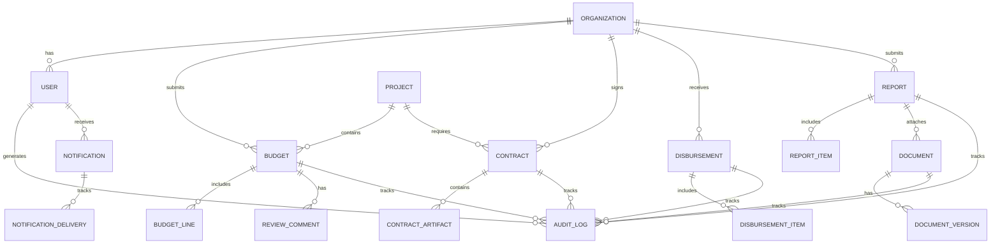
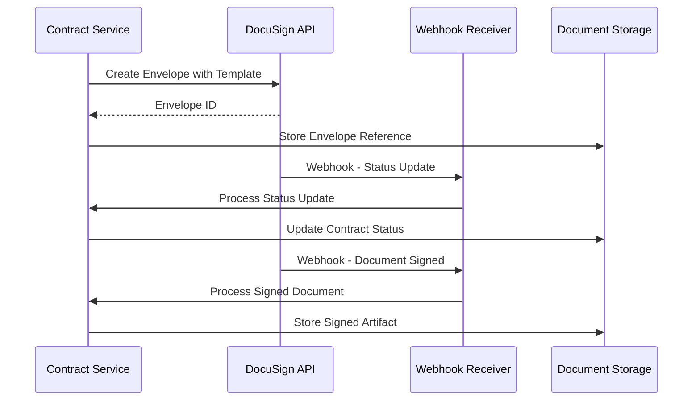
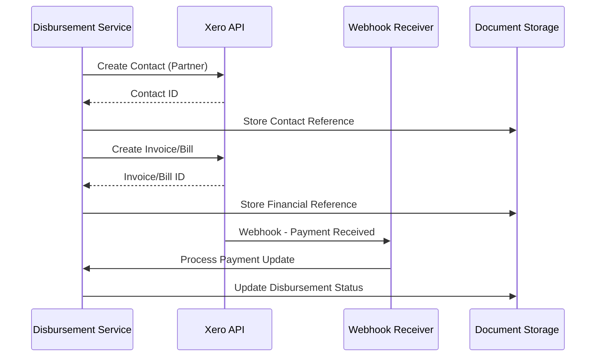
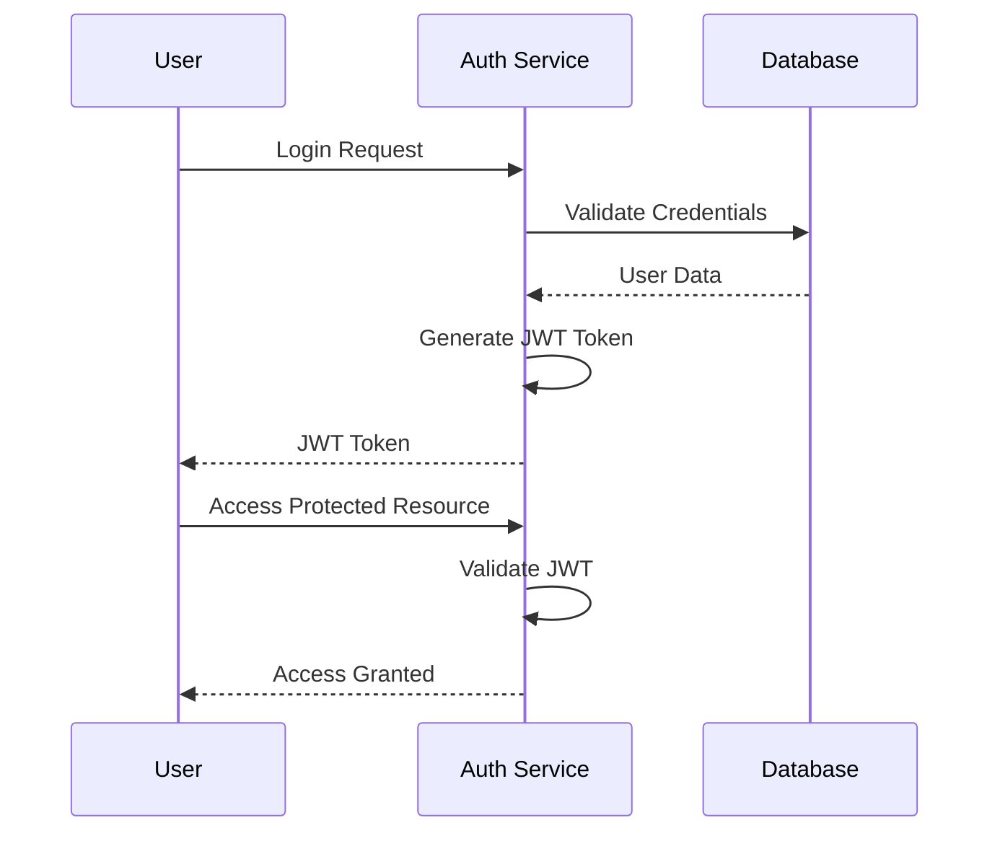
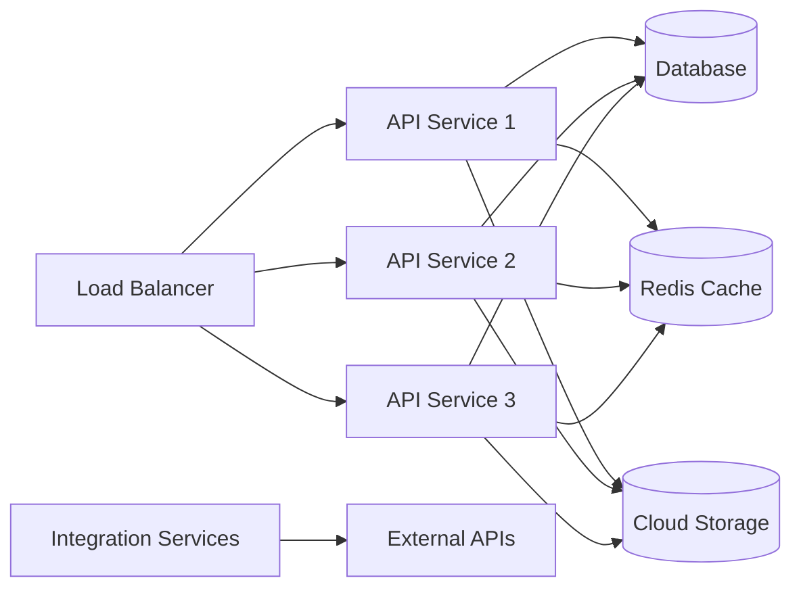

# System Architecture

## 1. High-Level Architecture

```mermaid
graph TD
    A[User Interface] --> B[API Gateway]
    B --> C[Authentication Service]
    B --> D[Workflow Engine]
    B --> E[Notification Service]
    B --> F[Reporting Engine]
    B --> G[Document Management]
    B --> H[Partner Management]
    B --> I[Grant Management]
    B --> J[Budget Management]
    B --> K[Contract Management]
    B --> L[Disbursement Management]
    B --> M[M&E Management]
    B --> N[Financial Management]
    
    C --> O[(Database)]
    D --> O
    E --> O
    F --> O
    G --> O
    H --> O
    I --> O
    J --> O
    K --> O
    L --> O
    M --> O
    N --> O
    
    K --> P[DocuSign Integration]
    L --> Q[Xero Integration]
    E --> R[Email Service]
    G --> S[Cloud Storage]
    
    style A fill:#4CAF50,stroke:#388E3C
    style B fill:#2196F3,stroke:#0D47A1
    style C fill:#FF9800,stroke:#E65100
    style D fill:#9C27B0,stroke:#4A148C
    style E fill:#FF5722,stroke:#BF360C
    style F fill:#795548,stroke:#3E2723
    style G fill:#607D8B,stroke:#263238
    style H fill:#009688,stroke:#004D40
    style I fill:#009688,stroke:#004D40
    style J fill:#009688,stroke:#004D40
    style K fill:#009688,stroke:#004D40
    style L fill:#009688,stroke:#004D40
    style M fill:#009688,stroke:#004D40
    style N fill:#009688,stroke:#004D40
    style O fill:#9E9E9E,stroke:#212121
    style P fill:#FFC107,stroke:#FF6F00
    style Q fill:#FFC107,stroke:#FF6F00
    style R fill:#FFC107,stroke:#FF6F00
    style S fill:#FFC107,stroke:#FF6F00
```

## 2. Component Architecture

### 2.1 API Gateway
The API Gateway serves as the single entry point for all client requests. It handles:
- Request routing to appropriate services
- Authentication and authorization
- Rate limiting and throttling
- Request/response transformation
- SSL termination

### 2.2 Authentication Service
Manages user authentication and authorization:
- User registration and login
- Role-based access control (RBAC)
- Session management
- Multi-factor authentication (MFA)
- OAuth 2.0/OpenID Connect integration

### 2.3 Workflow Engine
Orchestrates business processes and state transitions:
- Budget approval workflows
- Contract signing processes
- Disbursement scheduling
- Report review cycles
- State management for all entities

### 2.4 Notification Service
Handles all system communications:
- In-app notifications
- Email alerts
- SMS notifications (if required)
- Deadline reminders
- Escalation workflows

### 2.5 Reporting Engine
Generates operational and financial reports:
- Dashboard visualizations
- Export capabilities (PDF, Excel)
- Custom report builder
- Scheduled report generation

### 2.6 Document Management
Centralized storage and management of all documents:
- File upload and storage
- Version control
- Metadata management
- Access control
- Checksum validation

### 2.7 Domain Services
Specialized services for each core domain:

#### Partner Management
- Organization registration
- Profile management
- Compliance documentation
- Contact management

#### Grant Management
- Call/project creation
- Timeline management
- Category and cap definition
- Submission window control

#### Budget Management
- Budget template creation
- Line item management
- Validation rules
- Approval workflows

#### Contract Management
- Template management
- Data merging
- DocuSign integration
- Artifact storage

#### Disbursement Management
- Tranche planning
- Invoice generation
- Xero integration
- Payment tracking

#### M&E Management
- KPI tracking
- Milestone management
- Outcome reporting
- Risk indicators

#### Financial Management
- Spend reporting
- Receipt processing
- Reconciliation workflows
- Retirement processing

## 3. Data Architecture

### 3.1 Database Schema Overview

### 3.2 Data Storage Strategy

#### Primary Database (PostgreSQL)
- Relational data storage
- ACID compliance
- Complex query support
- Transaction management

#### Document Storage (Cloud Storage)
- Binary file storage
- Version control
- CDN integration
- Backup and replication

#### Cache Layer (Redis)
- Session storage
- Frequently accessed data
- Rate limiting counters
- Notification queues

## 4. Integration Architecture

### 4.1 DocuSign Integration

### 4.2 Xero Integration

## 5. Security Architecture

### 5.1 Authentication Flow

### 5.2 Authorization Model

- Role-Based Access Control (RBAC)
- Resource-level permissions
- Organization-level isolation
- Audit trail for all access attempts

## 6. Deployment Architecture

### 6.1 Cloud Infrastructure

### 6.2 Container Orchestration

- Docker containers for each service
- Kubernetes for orchestration
- Horizontal pod autoscaling
- Rolling updates for zero-downtime deployments

## 7. Monitoring and Observability

### 7.1 Metrics Collection
- Application performance metrics
- Database query performance
- API response times
- Error rates and patterns

### 7.2 Logging Strategy
- Structured logging with correlation IDs
- Centralized log aggregation
- Real-time log analysis
- Alerting on critical events

### 7.3 Tracing
- Distributed tracing with OpenTelemetry
- Request flow visualization
- Bottleneck identification
- Performance optimization insights