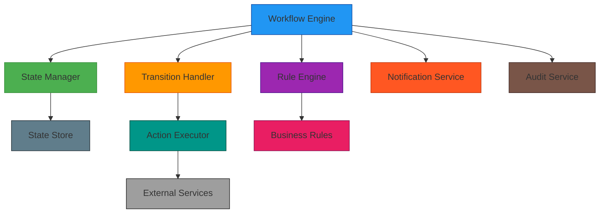
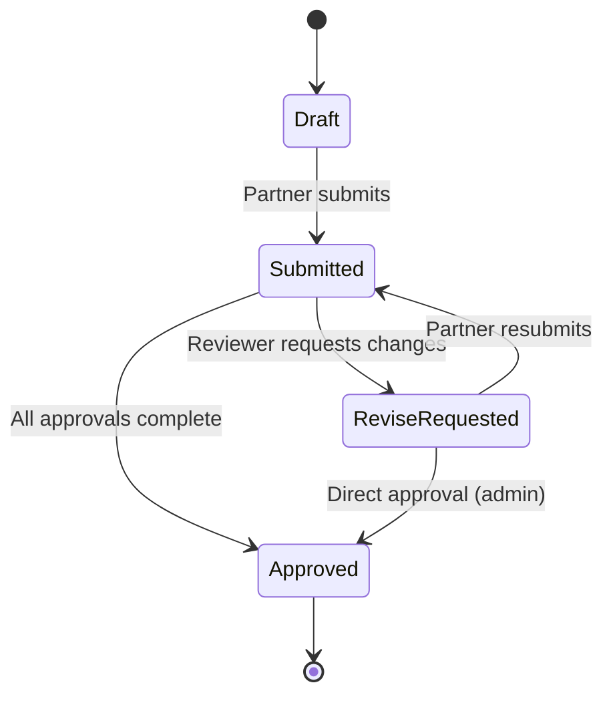
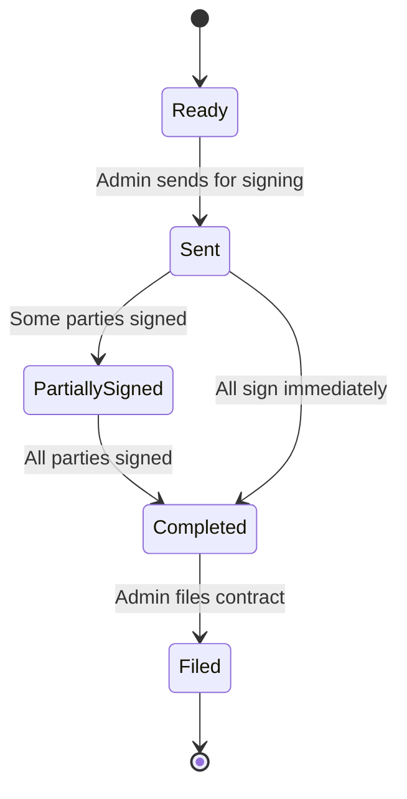
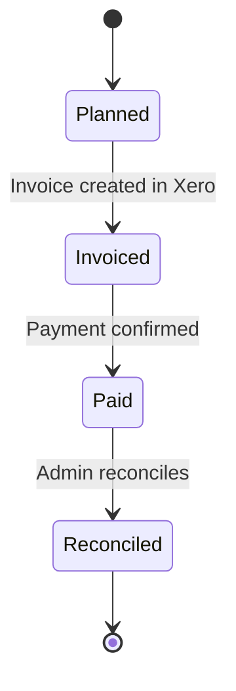
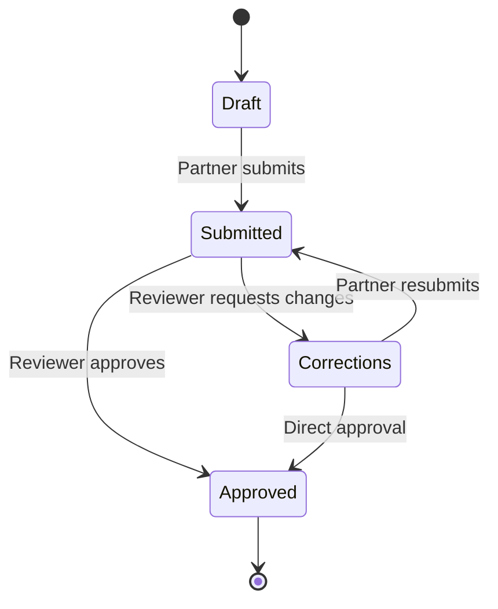
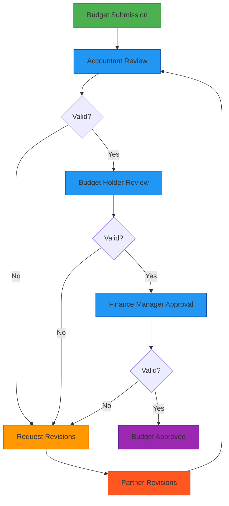
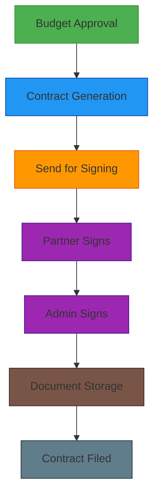
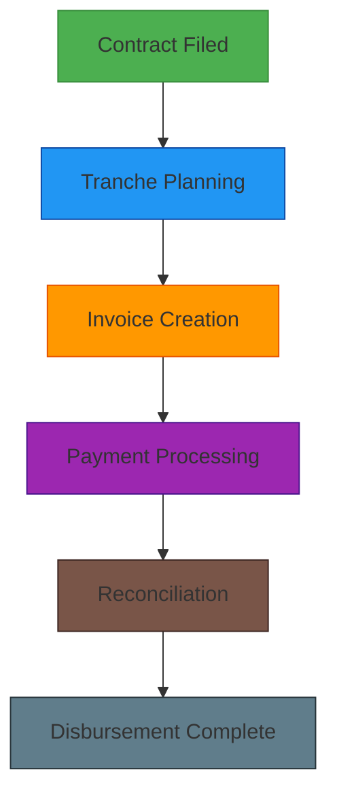

# Workflow Engine and State Management

## 1. Overview

The Workflow Engine is a core component of the Sub-Grant Management Platform that orchestrates business processes, manages entity state transitions, and enforces business rules. It ensures consistency across all lifecycle processes while providing flexibility for customization.

## 2. Architecture

### 2.1 High-Level Design



### 2.2 Core Components

#### 2.2.1 State Manager
- Tracks current state of all entities
- Enforces valid state transitions
- Maintains state history
- Provides state query capabilities

#### 2.2.2 Transition Handler
- Executes state transition logic
- Coordinates multi-step transitions
- Handles rollback on failures
- Manages transition dependencies

#### 2.2.3 Rule Engine
- Evaluates business rules for transitions
- Validates pre-conditions
- Enforces constraints
- Applies conditional logic

#### 2.2.4 Event System
- Publishes workflow events
- Subscribes to external events
- Handles event routing
- Manages event persistence

## 3. State Models

### 3.1 Budget State Model



#### 3.1.1 State Descriptions
| State | Description |
|-------|-------------|
| Draft | Initial state, budget being created |
| Submitted | Budget submitted for review |
| ReviseRequested | Changes requested by reviewer |
| Approved | Budget fully approved |

#### 3.1.2 Transition Rules
- Only partner users can submit budgets
- Only authorized reviewers can request revisions or approve
- Budget must pass validation before submission
- All required review comments must be resolved before approval

#### 3.1.3 Transition Actions
```javascript
// Pseudocode for budget state transitions
function handleBudgetTransition(budget, fromState, toState, user) {
  switch (toState) {
    case 'Submitted':
      validateBudget(budget);
      sendNotification('budget_submitted', budget);
      break;
    case 'ReviseRequested':
      createReviewComments(budget, user);
      sendNotification('budget_revision_requested', budget);
      break;
    case 'Approved':
      updateBudgetApproval(budget, user);
      triggerContractGeneration(budget);
      sendNotification('budget_approved', budget);
      break;
  }
  
  // Log state change
  auditLog.create({
    entity_type: 'budget',
    entity_id: budget.id,
    action: 'state_change',
    before_state: fromState,
    after_state: toState,
    actor_id: user.id
  });
}
```

### 3.2 Contract State Model



#### 3.2.1 State Descriptions
| State | Description |
|-------|-------------|
| Ready | Contract prepared, ready to send |
| Sent | Envelope sent to signers |
| PartiallySigned | Some signers have signed |
| Completed | All signers have signed |
| Filed | Contract archived and filed |

#### 3.2.2 Transition Rules
- Only admins can send contracts
- State updates via DocuSign webhooks
- Completed contracts can be filed by admins
- Contracts must be approved before becoming ready

#### 3.2.3 Transition Actions
```javascript
// Pseudocode for contract state transitions
function handleContractTransition(contract, fromState, toState, trigger) {
  switch (toState) {
    case 'Sent':
      const envelope = await docusign.createEnvelope(contract);
      contract.envelope_id = envelope.id;
      sendNotification('contract_sent', contract);
      break;
    case 'PartiallySigned':
      updateSignerStatus(contract, trigger.signer_data);
      sendNotification('contract_partially_signed', contract);
      break;
    case 'Completed':
      downloadSignedDocuments(contract);
      contract.completed_at = new Date();
      sendNotification('contract_completed', contract);
      break;
    case 'Filed':
      contract.filed_at = new Date();
      sendNotification('contract_filed', contract);
      break;
  }
}
```

### 3.3 Disbursement State Model



#### 3.3.1 State Descriptions
| State | Description |
|-------|-------------|
| Planned | Disbursement scheduled |
| Invoiced | Invoice/bill created in Xero |
| Paid | Payment confirmed in Xero |
| Reconciled | Admin has reconciled transaction |

#### 3.3.2 Transition Rules
- Only admins can plan disbursements
- Invoicing happens via Xero integration
- Payment status updates from Xero webhooks
- Reconciliation requires admin action

#### 3.3.3 Transition Actions
```javascript
// Pseudocode for disbursement state transitions
function handleDisbursementTransition(disbursement, fromState, toState) {
  switch (toState) {
    case 'Invoiced':
      const invoice = await xero.createInvoice(disbursement);
      disbursement.invoice_id = invoice.id;
      sendNotification('disbursement_invoiced', disbursement);
      break;
    case 'Paid':
      disbursement.paid_at = new Date();
      attachPaymentEvidence(disbursement);
      sendNotification('disbursement_paid', disbursement);
      break;
    case 'Reconciled':
      disbursement.reconciled_at = new Date();
      sendNotification('disbursement_reconciled', disbursement);
      break;
  }
}
```

### 3.4 Report State Model (M&E/Financial)



#### 3.4.1 State Descriptions
| State | Description |
|-------|-------------|
| Draft | Report being created |
| Submitted | Report submitted for review |
| Corrections | Changes requested by reviewer |
| Approved | Report approved |

#### 3.4.2 Transition Rules
- Only partner users can submit reports
- Only authorized reviewers can request corrections or approve
- Required fields must be completed
- Supporting documents must be attached

#### 3.4.3 Transition Actions
```javascript
// Pseudocode for report state transitions
function handleReportTransition(report, fromState, toState, user) {
  switch (toState) {
    case 'Submitted':
      validateReport(report);
      sendNotification('report_submitted', report);
      break;
    case 'Corrections':
      createReviewComments(report, user);
      sendNotification('report_corrections_requested', report);
      break;
    case 'Approved':
      updateReportApproval(report, user);
      checkProjectCompletion(report);
      sendNotification('report_approved', report);
      break;
  }
}
```

## 4. Workflow Definitions

### 4.1 Budget Approval Workflow



#### 4.1.1 Workflow Steps
1. **Partner Submission**
   - Validate budget against project categories
   - Check total amount against caps
   - Submit for review

2. **Accountant Review**
   - Verify calculations
   - Check compliance with guidelines
   - Approve or request revisions

3. **Budget Holder Review**
   - Review overall allocation
   - Check strategic alignment
   - Approve or request revisions

4. **Finance Manager Approval**
   - Final financial approval
   - Trigger contract generation
   - Update project financials

#### 4.1.2 Workflow Rules
- Each reviewer can only approve at their level
- Revisions must address all comments
- Approval must follow sequential order
- Time limits for each review stage

### 4.2 Contract Execution Workflow



#### 4.2.1 Workflow Steps
1. **Contract Generation**
   - Populate template with budget data
   - Create DocuSign envelope
   - Assign signers

2. **Signing Process**
   - Send envelope to all signers
   - Track signing status
   - Receive completed documents

3. **Document Management**
   - Store signed documents
   - Update contract status
   - File completed contract

#### 4.2.2 Workflow Rules
- Contract can only be generated after budget approval
- All designated signers must sign
- Signed documents must be stored securely
- Contract must be filed after completion

### 4.3 Disbursement Workflow



#### 4.3.1 Workflow Steps
1. **Tranche Planning**
   - Define disbursement schedule
   - Set amounts and dates
   - Link to approved budget

2. **Invoice Creation**
   - Generate invoice in Xero
   - Link to partner contact
   - Track invoice status

3. **Payment Processing**
   - Monitor payment status
   - Receive payment confirmations
   - Update disbursement status

4. **Reconciliation**
   - Verify payment details
   - Attach evidence documents
   - Close disbursement

#### 4.3.2 Workflow Rules
- Disbursements require filed contract
- Invoice amounts must match tranche
- Payment evidence must be attached
- Disbursement must be reconciled before closing

## 5. Event System

### 5.1 Event Types

#### 5.1.1 State Change Events
- `budget.state.changed`
- `contract.state.changed`
- `disbursement.state.changed`
- `report.state.changed`

#### 5.1.2 System Events
- `user.registered`
- `document.uploaded`
- `notification.sent`
- `integration.sync.completed`

#### 5.1.3 External Events
- `docusign.envelope.completed`
- `xero.invoice.paid`
- `email.opened`
- `webhook.received`

### 5.2 Event Handling

```javascript
// Pseudocode for event handling
class WorkflowEventHandler {
  async handleEvent(event) {
    // Log event
    await eventLog.create(event);
    
    // Process event based on type
    switch (event.type) {
      case 'budget.state.changed':
        await this.handleBudgetStateChange(event);
        break;
      case 'docusign.envelope.completed':
        await this.handleContractCompletion(event);
        break;
      case 'xero.invoice.paid':
        await this.handlePaymentReceived(event);
        break;
    }
    
    // Trigger any follow-up events
    await this.triggerFollowUpEvents(event);
  }
  
  async handleBudgetStateChange(event) {
    const budget = await Budget.findById(event.entity_id);
    
    // Send notifications
    if (budget.status === 'Submitted') {
      await notificationService.send({
        type: 'budget_submitted',
        recipients: ['accountant', 'budget_holder', 'finance_manager'],
        data: { budget_id: budget.id }
      });
    }
    
    // Check if all approvals are complete
    if (budget.status === 'Approved') {
      await workflowEngine.trigger('contract.generate', { budget_id: budget.id });
    }
  }
}
```

### 5.3 Event Persistence

#### 5.3.1 Event Store Schema
```sql
CREATE TABLE workflow_events (
    id UUID PRIMARY KEY DEFAULT gen_random_uuid(),
    type VARCHAR(100) NOT NULL,
    entity_type VARCHAR(50),
    entity_id UUID,
    payload JSONB,
    processed BOOLEAN DEFAULT FALSE,
    processed_at TIMESTAMP,
    created_at TIMESTAMP NOT NULL DEFAULT CURRENT_TIMESTAMP
);

CREATE INDEX idx_workflow_events_type ON workflow_events(type);
CREATE INDEX idx_workflow_events_entity ON workflow_events(entity_type, entity_id);
CREATE INDEX idx_workflow_events_processed ON workflow_events(processed);
```

#### 5.3.2 Event Processing
- Asynchronous event processing
- Dead letter queue for failed events
- Retry mechanisms with exponential backoff
- Monitoring and alerting for event processing

## 6. Rule Engine

### 6.1 Business Rules

#### 6.1.1 Budget Validation Rules
```javascript
// Pseudocode for budget validation rules
class BudgetValidationRules {
  async validate(budget) {
    const errors = [];
    
    // Check total amount against project cap
    if (budget.total_amount > budget.project.budget_cap) {
      errors.push('Total budget exceeds project cap');
    }
    
    // Check line items against category caps
    for (const line of budget.lines) {
      if (line.amount > line.category.cap_amount) {
        errors.push(`Line item exceeds category cap for ${line.category.name}`);
      }
    }
    
    // Check required fields
    if (!budget.title || !budget.description) {
      errors.push('Title and description are required');
    }
    
    return errors;
  }
}
```

#### 6.1.2 Approval Workflow Rules
```javascript
// Pseudocode for approval workflow rules
class ApprovalWorkflowRules {
  canTransition(user, entity, fromState, toState) {
    // Check user permissions
    if (!this.hasPermission(user, entity, toState)) {
      return false;
    }
    
    // Check business rules
    if (toState === 'Approved') {
      return this.allRequiredApprovalsComplete(entity);
    }
    
    return true;
  }
  
  hasPermission(user, entity, state) {
    const permissions = {
      'Accountant': ['Submitted', 'ReviseRequested'],
      'Budget Holder': ['Submitted', 'ReviseRequested'],
      'Finance Manager': ['Submitted', 'ReviseRequested', 'Approved'],
      'Partner': ['Draft', 'ReviseRequested']
    };
    
    return permissions[user.role]?.includes(state) || false;
  }
}
```

### 6.2 Conditional Logic

#### 6.2.1 Dynamic Routing
- Route approvals based on budget amount
- Escalate to higher authorities for large amounts
- Apply different rules for different project types

#### 6.2.2 Exception Handling
- Handle special cases in workflow
- Apply override rules when necessary
- Log exceptions for audit purposes

## 7. Monitoring and Metrics

### 7.1 Workflow Metrics

#### 7.1.1 Process Metrics
- Average time in each state
- Approval cycle times
- Revision request frequency
- Completion rates

#### 7.1.2 Performance Metrics
- Event processing latency
- Workflow execution time
- System resource usage
- Error rates

### 7.2 Dashboard Views

#### 7.2.1 Admin Dashboard
- Active workflows by type
- Bottlenecks in approval processes
- Upcoming deadlines
- Exception alerts

#### 7.2.2 User Dashboard
- Personal workflow items
- Pending actions
- Recent activity
- Upcoming deadlines

## 8. Implementation Considerations

### 8.1 Scalability
- Horizontal scaling of workflow processors
- Database optimization for state queries
- Caching for frequently accessed workflows
- Asynchronous processing for long-running workflows

### 8.2 Reliability
- Transactional state updates
- Rollback mechanisms for failed transitions
- Dead letter queues for persistent failures
- Backup and recovery procedures

### 8.3 Maintainability
- Modular workflow definitions
- Version control for workflow changes
- Testing framework for workflows
- Documentation of business rules

### 8.4 Security
- Role-based access to workflows
- Audit logging for all workflow actions
- Secure event transmission
- Protection against workflow manipulation